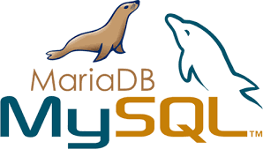

# Brief Bases de données relationnelle  

Anne-Laure MEALIER 09.11.2020  

Découverte des Systèmes de Gestion de Base de Données Relationnelle au travers de MySQL.  

## Ressource(s)  

* [Document décrivant le brief](https://docs.google.com/document/d/1zkOrlAD9x4Pq4ZCuP-cmYQSbLyGa1ISTe49b15A6xRI/edit)  

## Contexte du projet  

Ce brief va nous permettre de nous interroger sur les caractéristiques des SGBD relationnels classiques : leurs forces, leurs propriétés ACID, leurs faiblesses ...  
Comment se distingent-elles des systèmes NoSQL & NewSQL.  

Nous utiliserons ensuite MYSQL pour apprendre le langage SQL :  

* Créer des tables  
* Charger des données  
* Effectuer des requêtes sur les tables créées  
* Nettoyer & manipuler les données  

## Modalités pédagogiques  

Vous travaillerez par groupes de 4 ou 5 préalablement constitués.  

## Livrables  

Document .txt ou .sql (vim, nano, Kate, Notepad...) comprenant toutes les commandes SQL exécutées dans le terminal pour répondre aux questions.  
Le document doit-être "poussé" sur votre compte personnel github le mardi 10 November à 17h.  

