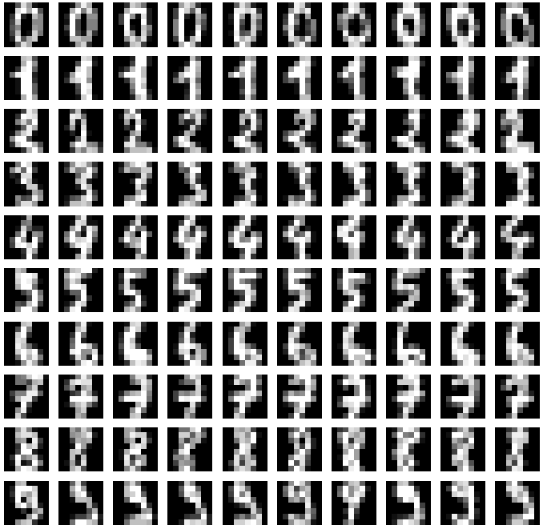

# Detect hand-written digits with logistic regression and explore gradient descent  

Adrien Dulac 24.11.2020  

keywords : numpy, scikit-learn, logistic regression, descente de gradient, optimisation  

## Contexte du projet  

* https://github.com/dtrckd/simplon_datai_2020/blob/master/brief_3/  

## Description

Mr Pontier is back and needs your help. He needs to automatically detect hand-written digits written on pictures that represents the phone numbers of his clients and collaborators.
Because he has thousands of documents, this will take far too long to do it manually. This is why he asked you if you can design an algorithm that automatically detects the number from the pictures.  

Furthermore, Mr Pontier wants to :  
* Understand how the algorithm works  
* Compare the performance with several classification algorithms  
* Observe the convergence of a grandient descent algorithm for further investigation  

## Proposed Plan

**1) Get & understand your data**

git clone the repository and run the given notebook in https://github.com/dtrckd/simplon_datai_2020/blob/master/brief_3/.

* What is the type of the data ?  
* How many pixel has one data instance ?  
* What is the type of data of one pixel ? what does it represents ?  

**2) Prepare your ML algorithm**

> Veille  

How to evaluate classification algorithms ?  
* https://scikit-learn.org  
* Wikipedia  
* Towards data science  
* ...  

> Questions  

* Write the equation of the **precision** & **recall** score and explicit what each term represents  
* Explain the purpose of the TRAIN set ?  
* Explain the purpose of the TEST set ?
* What does the `train_test_split` function in sklearn do ?  

Use the `train_test_split` function of sklearn to build a test set with size that represents 20% of the original dataset (and 80% for the training set).  
Check that the ratio is correct.  

**3) Predict Digits**  

In the dataset we have multiple labels. Therefore, to start we will predict in a binary case. It means that we will predict only if an image is a given digit (for exemple `7`) or not.  
To do so, we will implement a **logistic regression** algorithm plus (at least) **two** others of your choice.  

Fit the model and show the performance results whithin a table for each model in terms of :  
* **precision** score on TEST set  
* **recall** score on TEST set  
* Inference time for each algorithm  

How many input data the algorithm needs to be efficient (and why) ?  
Compare the performance with TRAIN set. What do you observe ?  

**4) Multi-class classification**  

Fit now the algorithm in the multiclass case (ie using all the classes, targets).  

Show the result with :  
* Confusion matrix (see sklearn.metrics.plot_confusion_matrix)  
* Classification report (see sklearn.metrics.classification_report)  

**5) Gradient descent ?**  

We want to observe the convergence of the performance.
To do so, we want to implement our own version of the Logistic regression inference algorithm.  

> Veille  

* What algorithm uses sklearn to estimate the model parameters for the logistic regression ?  
* What are the keys equations we need to implement the algorithm ?  
* What is the difference between the gradient descent and the stochastic gradient descent ?  

Write the *pseudo-code* of the algorithm to be sure to understand all the different steps  :  
* https://fr.wikipedia.org/wiki/Pseudo-code  

Implement the gradient descent for the logistic regression.  

Show the convergence of the performance results with two graphics :  
* **precision** score on TEST set & TRAIN set  
* **recall** score on TEST set & TRAIN set  

What is the impact of the learning rate on the convergence ?  
What difference do you observe on the results between TRAIN & TEST set ?  

Compare the convergence and performance with the stochastic gradient descent for the logistic regression.  
How it can be used in the Hessian matrix ?  

## Modalités pédagogiques  

Travail en groupe.  

## Critères de performance  

Model comparaison with tables.  

## Livrables  

Notebook avec réponses aux questions, veilles et algorithme reproductible  
