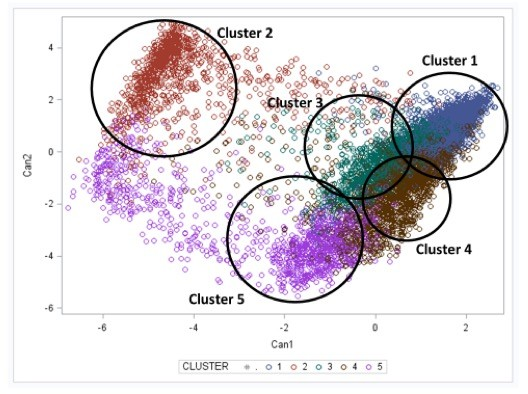

# Clustering with K-means  

Adrien Dulac 06.01.2021  

Découvrir l'apprentissage non-supervisé au travers de l'algorithme K-means.  

## Ressource(s)  

* https://github.com/dtrckd/simplon_datai_2020/blob/master/brief_6/brief.md  

## Contexte du projet  

L'apprentissage supervisé se présente comme une approche de l'apprentissage automatique qui permet de découvrir la structure sous-jacente des données en l'absence d'étiquetage, c'est à dire sans catégories ou classe connues en avance.  
Afin de se familiariser avec cette approche et mieux l'appréhender pour l'utiliser dans des scénario plus complexes, les objectifs sont les suivants :  
* Comprendre le principe de cette technique et les scénarios d'utilisation  
* Comprendre, expérimenter & évaluer ce type algorithmes : K-means sur un jeu de données simple  
* Comprendre & comparer les métriques d'évaluation  
* Tester sur des jeux précédemment utilisés  
 
## Veilles  

* Qu'est ce que le clustering ?  
* Est ce un probleme difficile ? pourquoi ?  
* Donnez la compléxité en temps et mémoire  
* Quels sont les métriques utilisés pour le clustering ?  
* Ecrivez en une phrase votre compréhension pour 3 métriques avec ground truth (dont MNI)  
* 3 sans ground truth (dont silouhette)  
* Donner en une phrase l'intuition derrière ces mesures ...  
* Différence entre NMI & AMI ?  

## To DO  

* Visualisation des clusters en 2 ou 3D via l'emploi des algorithmes de réduction de dimensions  
* Recherche du nombre clusters optimaux au regard de l'inertie & la silhouette  
* Etude de la qualité des clusters avec vérité terrain  

## Modalités pédagogiques  

Durée = 2 jours  

## Critères de performance  

Qualité/structure du code  

## Livrables  

* [Git](https://github.com/Olivier-Prince/dev-ia-simplon/tree/main/RNCP34757BC02/01-clustering-with-K-means)  
* [Notebook](https://github.com/Olivier-Prince/dev-ia-simplon/tree/main/RNCP34757BC02/01-clustering-with-K-means/notebooks)  

